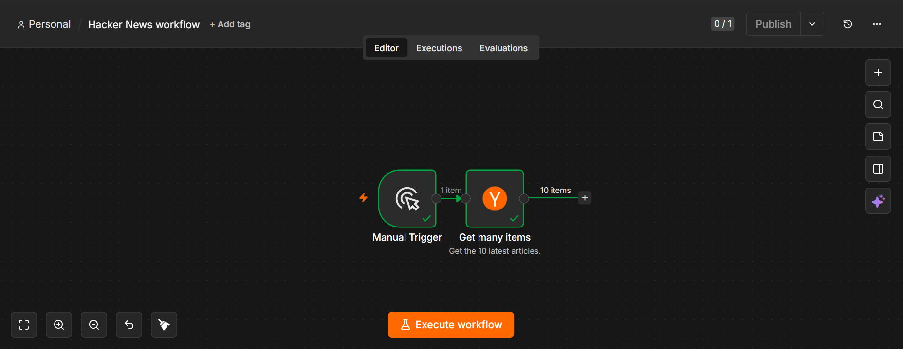

# Hacker News Workflow

## Overview

This n8n workflow retrieves the latest stories from the Hacker News API and processes the data for further automation or analysis.

## Features

- Fetches top Hacker News stories
- Processes API response
- Extracts relevant information
- Ready for integration with other n8n workflows

## Technologies Used

- n8n
- HTTP Request
- Hacker News API
- JSON

## Files

| File | Description |
|------|-------------|
| `Hacker-news-workflow.json` | Importable n8n workflow |
| `hacker-news-workflow.png` | Screenshot of the workflow |

## Screenshot

