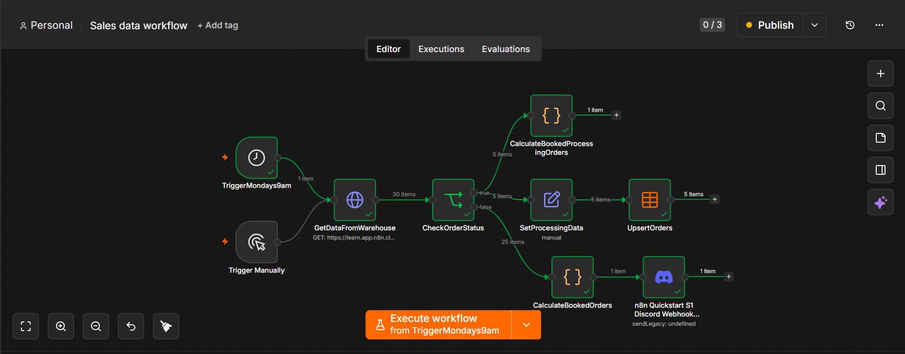

# Sales Data Workflow

## Overview

This n8n workflow processes sales data and performs calculations to generate useful business insights.

## Features

- Processes sales records
- Performs data calculations
- Organizes structured output
- Ready for reporting and automation

## Technologies Used

- n8n
- Code Node (JavaScript)
- JSON

## Files

| File | Description |
|------|-------------|
| `sales-data-workflow.json` | Importable n8n workflow |
| `sales-data-workflow.png` | Screenshot of the workflow |

## Screenshot

