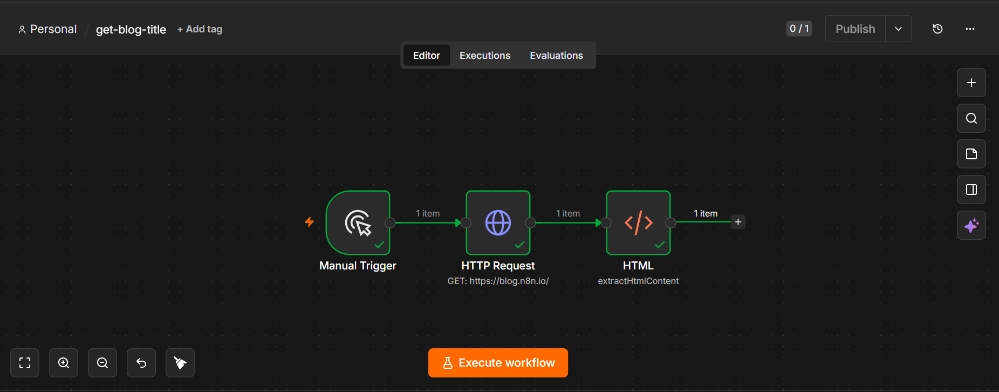

# Get Blog Title Workflow

## Overview

This n8n workflow sends an HTTP request to a blog webpage and extracts the blog title from the HTML content.

## Workflow Steps

1. **Manual Trigger** – Starts the workflow manually.
2. **HTTP Request** – Retrieves the HTML content of the target webpage.
3. **HTML** – Extracts the blog title from the HTML response.

## Features

- Fetches webpage content
- Parses HTML
- Extracts the page title
- Demonstrates basic web scraping with n8n

## Technologies Used

- n8n
- HTTP Request Node
- HTML Node
- Web Scraping
- JSON

## Files

| File | Description |
|------|-------------|
| `get-blog-title(1).json` | Importable n8n workflow |
| `get-blog-title.png` | Screenshot of the workflow |

## Screenshot

