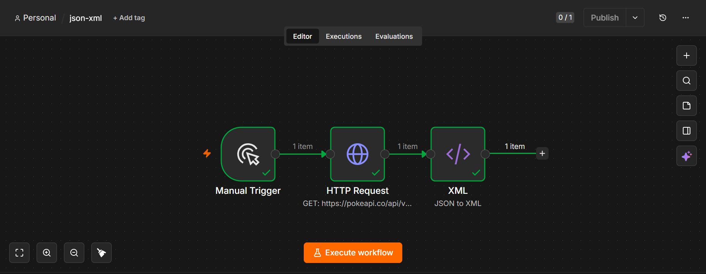

# JSON to XML Workflow

## Overview

This n8n workflow retrieves data from a REST API in JSON format and converts the response into XML format.

## Workflow Steps

1. **Manual Trigger** – Starts the workflow manually.
2. **HTTP Request** – Fetches JSON data from the PokéAPI.
3. **XML** – Converts the JSON response into XML.

## Features

- Fetches data from a public REST API
- Converts JSON to XML
- Demonstrates data format transformation
- Useful for integrations requiring XML output

## Technologies Used

- n8n
- HTTP Request Node
- XML Node
- REST API
- JSON
- XML

## Files

| File | Description |
|------|-------------|
| `json-xml(1).json` | Importable n8n workflow |
| `JSON-to-XML.png` | Screenshot of the workflow |

## Screenshot

