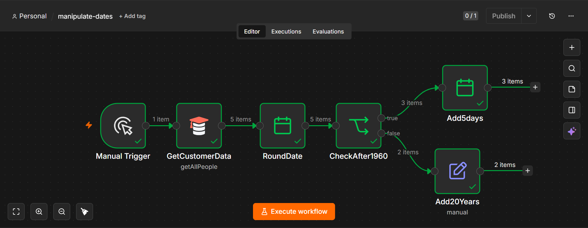

# Manipulate Dates Workflow

## Overview

This n8n workflow retrieves customer data, manipulates date values, and applies different date operations based on a condition.

## Workflow Steps

1. **Manual Trigger** – Starts the workflow manually.
2. **GetCustomerData** – Retrieves customer records.
3. **RoundDate** – Rounds or formats date values.
4. **CheckAfter1960** – Checks whether the date is after the year 1960.
5. **Add5Days** – Adds 5 days to dates that meet the condition.
6. **Add20Years** – Adds 20 years to dates that do not meet the condition.

## Features

- Retrieves customer data
- Manipulates and formats dates
- Applies conditional logic using an IF node
- Performs multiple date calculations
- Demonstrates branching workflows in n8n

## Technologies Used

- n8n
- Date & Time Node
- IF Node
- Set Node
- JSON

## Files

| File | Description |
|------|-------------|
| `manipulate-dates-workflow.json` | Importable n8n workflow |
| `manipulate-dates-workflow.png` | Screenshot of the workflow |

## Screenshot

