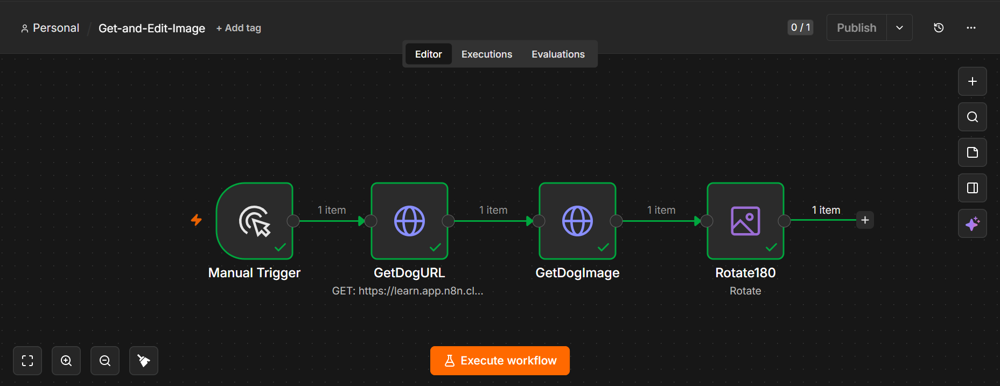

# Get and Edit Image Workflow

## Overview

This n8n workflow retrieves an image from a remote source and performs an image transformation by rotating it 180 degrees.

## Workflow Steps

1. **Manual Trigger** – Starts the workflow manually.
2. **GetDogURL** – Retrieves the URL of a random dog image.
3. **GetDogImage** – Downloads the image from the retrieved URL.
4. **Rotate180** – Rotates the image by 180 degrees.

## Features

- Retrieves images from an external API
- Downloads image files
- Performs image processing
- Demonstrates handling of binary data in n8n

## Technologies Used

- n8n
- HTTP Request Node
- Image Node
- Binary Data
- REST API

## Files

| File | Description |
|------|-------------|
| `Get-and-Edit-Image-workflow.json` | Importable n8n workflow |
| `get-and-edit-image.png` | Screenshot of the workflow |

## Screenshot

