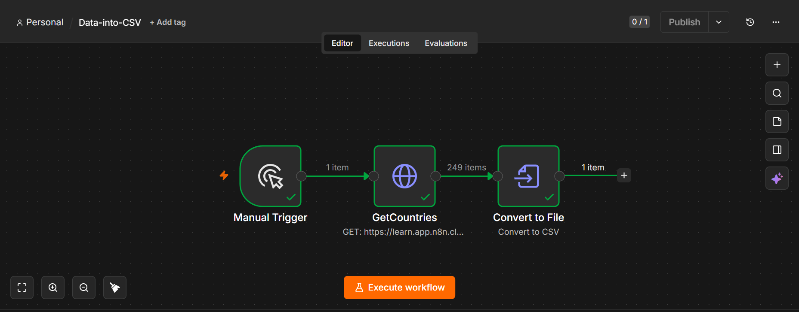

# Data into CSV Workflow

## Overview

This n8n workflow retrieves country data from an API and converts the JSON response into a CSV file.

## Workflow Steps

1. **Manual Trigger** – Starts the workflow manually.
2. **GetCountries** – Fetches country data from an external API.
3. **Convert to File** – Converts the retrieved JSON data into a CSV file.

## Features

- Retrieves data from a REST API
- Converts JSON data to CSV
- Generates downloadable CSV files
- Demonstrates file conversion and data export in n8n

## Technologies Used

- n8n
- HTTP Request Node
- Convert to File Node
- REST API
- JSON
- CSV

## Files

| File | Description |
|------|-------------|
| `Data-into-CSV.json` | Importable n8n workflow |
| `data-into-CSV-workflow.png` | Screenshot of the workflow |

## Screenshot

